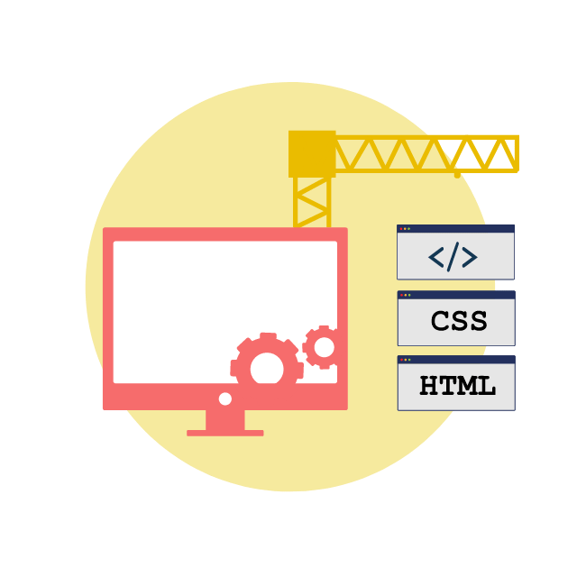

<h1 align="center">
FOODFY
   
   
  

   
 
 DESAFIO FINAL DO BOOTCAMP LAUNCHBASE
</h1>

Projeto desenvolvido como critério de aprovação para o bootcamp ministrado pela Rocketseat.

Agradecimento especial ao instrutor <a href='https://github.com/maykbrito/'>Mayk Brito</a> por toda a dedicação ao desenvolvimento de seus alunos.

  

[//]: # (Add your gifs/images here:)

  <gif src="demo/8633-web-development.gif" alt="demo" height="425">
  

## Características
Este sistema utiliza os conceitos mais fundamentais do desenvolvimento web, passando pelo frontend e pelo backend.

- :hearts: **Node JS** — Framawork web para NodeJS
- :page_facing_up: **Nunjucks** — Template engine para Javascript
- :elephant: **PostgreSQL** — BD relacional OpenSource.

## Como utilizar?

<h1 align='center'>
PROJETO EM CONSTRUÇÃO
</h1
  

## Licença

Esse projeto está sob a licença MIT. Veja a página [LICENSE](https://opensource.org/licenses/MIT) para mais detalhes.
